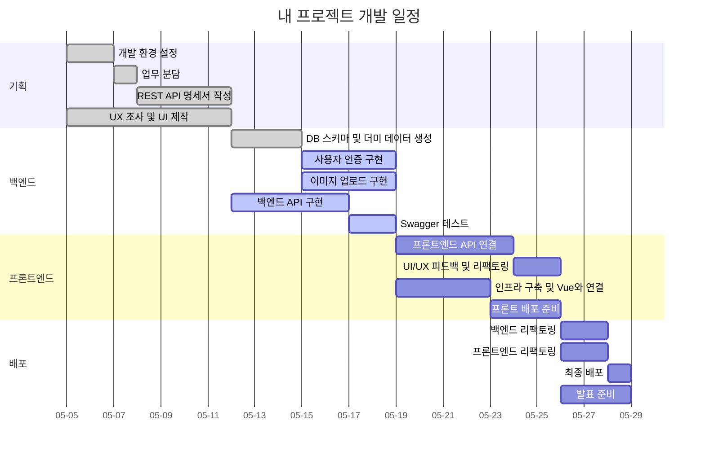

# treaXure

서울 배경의 **탐방 소셜 플랫폼**

재미있는 경험을 추구하는 젊은 세대를 위해, 서울을 무대로 탐험하고 즐기며 경험할 수 있는 **참여형 여행 게임 플랫폼**

## 목표

> "호랑이는 죽어서 가죽을 남기고 **서울은 탐험하며 사진을 남긴다**"

서울 명소에 기반한 탐험 미션과 보상을 통해 이용자에게 **재미 + 여행 정보 + 성취감 + 인스타 감성 사진**을 동시에 제공하는 게임형 관광 플랫폼 구현

## 기획 배경

- K-관광의 성장

  - 2024년 서울 방문 외국인 관광객은 1,314만 명
  - 코로나19 이전보다 폭발적으로 성장

- 여행 트렌드의 변화

  - 기존의 단순 관광에서 벗어나 체험형 컨텐츠를 원하는 수요 증가

- Alpha세대·MZ세대
  - 스토리텔링 기반의 콘텐츠, SNS 인증 요소, 게임 점수 같은 흥미 요소 선호

## 컨셉

1. 탐험(Exploration)

   - 단순한 방문이 아닌, 지도를 따라 장소를 탐색하며 미션을 수행

2. 게임화(Gamification)

   - 미션 완료, AI 유사도 평가, 랭킹, 보상 등 게임 요소 접목

3. 참여(Participation)

   - 사진 인증, SNS 스타일 게시판, 좋아요 등 사용자 주도형 콘텐츠 생성

4. AI 기술 활용

   - 인증 사진과 미션 원본의 이미지 유사도 분석을 통한 정밀 평가

5. 위치 기반(Location-based)

   - KakaoMap을 활용한 지도 중심 UI, 현 위치 기반 미션 추천

6. 서울 기반 콘텐츠

   - 경복궁, 남산타워, 이화마을 등 서울의 랜드마크를 주 무대로 구성

## 기술 스택

- **UI/UX**: Figma
- **Frontend**: Vue.js
- **Backend**: Spring Boot
- **Database**: MySQL
- **Infra/Deployment**: AWS EC2/RDS/S3/CloudFront/Lambda/SQS
- **AI**: OpenAI API

## 개발 일정

## 배포

- **EC2**: Spring Boot 기반 백엔드 서버 운영
- **S3**: 미션/게시물/사용자 프로필 이미지 저장소
- **RDS**: MySQL 기반 관계형 데이터베이스
- **도메인 연결**: `treaxure.netlify.app` (프론트) + EC2 (백엔드) 연동
- **HTTPS 적용**: 보안 인증서 발급 및 혼합 콘텐츠 방지 처리 완료

## 페이지별 기능

### [로그인/회원가입]

| 온보딩 | 로그인 | 회원가입 |
| -------- | -------- | -------- |
|  |  |  | 

### [소셜 로그인]

| 카카오 로그인 | 네이버 로그인 |
| -------- | -------- |
|  |  |

### [탐험]

| 탐험 (1) | 탐험 (2) | 탐험 (3) |
| -------- | -------- | -------- |
|  |  |  |

### [미션 확인]

| 장소 클릭 | 장소 미션 확인 |
| -------- | -------- |
|  |  |

### [미션 수행]

| 미션 수행 전 | 미션 이미지 업로드 |
| -------- | -------- |
|  |  |

### [미션 결과]

| 미션 이미지 유사도 측정 | 유사도 측정 결과 |
| -------- | -------- |
|  |  |

### [기록]

| 탐험 기록 전 | 탐험 기록 후 | 상세보기(완료 미션) | 상세보기(미완료 미션) |
| -------- | -------- | -------- | -------- |
|  |  |  |  |  

### [탐색]

| 탐색 | 검색 |
| -------- | -------- |
|  |  |

### [랭킹]

| 랭킹 | 랭킹 좋아요 |
| -------- | -------- |
|  |  |

### [마이]

| 내 정보 | 정보 수정 전 | 정보 수정 | 좋아요한 사진 |
| -------- | -------- | -------- | -------- |
|  |  |  |  |

## 개발자

|                                                          **노다빈**                                                          |                                                           **유소은**                                                            |
| :--------------------------------------------------------------------------------------------------------------------------: | :-----------------------------------------------------------------------------------------------------------------------------: |
| [   @nodb](https://github.com/nodb) | [   @YuSoeun](https://github.com/YuSoeun) |
|                                                       FE │ BE │ UI/UX                                                        |                                                         FE │ BE │ INFRA                                                         |

## 라이선스

이 프로젝트는 MIT 라이선스로 배포됩니다.
상세한 라이선스 정보는 LICENSE 파일에서 확인할 수 있습니다.
